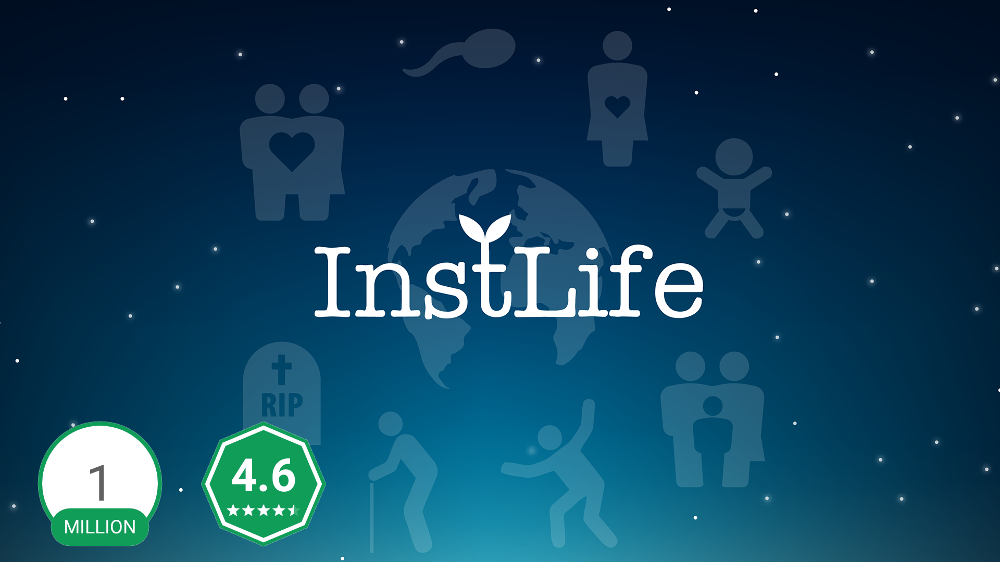
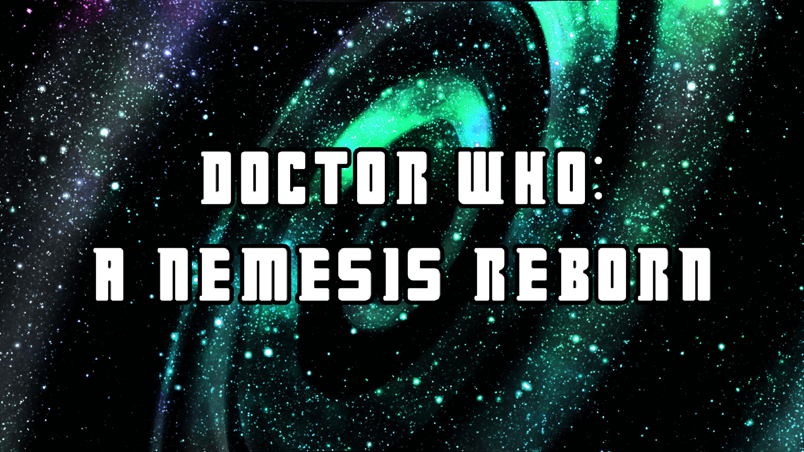

<!doctype html>

<html lang="en">

<head>
  <meta charset="utf-8">

  <title>Roopak</title>
  <meta name="description" content="Portfolio site for freelance game developer Roopak.">
  <meta name="author" content="Roopak">

  <link rel="stylesheet" href="css/main.css">
  <link rel="shortcut icon" type="image/ico" href="favicon.ico"/>
  
</head>

<body>
  

    <header class="intro">
      <h1 class="intro__hello">Hello!</h1>
      

        
        <h2 class="intro__tagline">I'm
          Roopak. Game Developer/Artist living in India
        </h2>
      

      <h3 class="intro__contact">Got an interesting project? Would love to colab send me a message at
        
          <a href="mailto:info@joebrogers.com" target="_blank" class="highlight-link">info@joebrogers.com</a>
        
      </h3>
    </header>
    
    <section class="section background" data-sr>
      

        Background
         
        
      

      

        
I'm a freelance game developer/artist , currently based in
          <strong>Tamilnadu, IN</strong>.Currently finishing up my bachelor's degree in Computer Science while working on personal projects
          
        

      

    </section>

    <section class="section skills" data-sr>
      
Skills

      

        

          

            
Languages

            <ul>
			  <li class="skillz__category__item">C++</li>
              <li class="skillz__category__item">C++</li>
              <li class="skillz__category__item">C#</li>
              <li class="skillz__category__item">Python</li>
              <li class="skillz__category__item">JavaScript (ES6)</li>
              <li class="skillz__category__item">PHP</li>
              <li class="skillz__category__item">Pearl</li>
            </ul>
          

          

            
Engines / Frameworks

            <ul>
              <li class="skillz__category__item">Unity</li>
              <li class="skillz__category__item">Unreal 4</a></li>
              <li class="skillz__category__item">.NET</li>
			  <li class="skillz__category__item">SFML</li>
              
            </ul>
          

          

            
Tools

            <ul>
              <li class="skillz__category__item">Blender 3D</li>
              <li class="skillz__category__item">ZBrush</li>
              <li class="skillz__category__item">Adobe Photoshop</li>
              
            </ul>
          

          

            
Interests

            <ul>
              <li class="skillz__category__item">OpenGL</li>
              <li class="skillz__category__item">Direct X</li>
              <li class="skillz__category__item">Human Computer Interaction	</li>
              <li class="skillz__category__item">Ray Tracing</li>
              <li class="skillz__category__item">User Interface</li>
			  <li class="skillz__category__item">Cloud Gaming</li>
            </ul>
          

        

      

    </section>

    <section class="section featured-projects" data-sr>
      
Featured Projects

      

        

          <figure class="project__pic">
            
          </figure>
          <figcaption class="project__caption">
            

              <a href="https://www.rockstargames.com/V/" target="_blank">Grand Theft Auto V: Online</a>
            

            
I worked as an Online Tools Designer at Rockstar North. Within this role I worked on both GTA V Online and GTA
              V Online: The Doomsday Heist. I scripted events and designed content within the game and extended the development
              tools used within the teams.

          </figcaption>
        

        

          <figure class="project__pic">
            
          </figure>
          <figcaption class="project__caption">
            

              <a href="https://play.google.com/store/apps/details?id=com.instcoffee.instlife" target="_blank">InstLife</a>
            

            
I was brought in as a contractor for InstLife to develop a save/load serialization system. I had to make a number of data abstractions to make serialization of core information possible, as well as link it up with various gameplay and user interface scripts.

          </figcaption>
        

        

          <figure class="project__pic">
            
          </figure>
          <figcaption class="project__caption">
            

              <a href="https://joebrogers.github.io/xdrm" target="_blank">
                Xtreme Drone Racing Micro</a>
            

            
Xtreme Drone Racing Micro is an arcade racing game developed for mobile platforms. The game puts emphasis on
              fast-paced action, with 40 AI competitors and short bursts of gameplay. Defeat your rivals, earn coins and
              completely customise your drone with over 40 million combinations!

          </figcaption>
        

        

          <figure class="project__pic">
            
          </figure>
          <figcaption class="project__caption">
            

              <a href="https://joebrogers.github.io/solys" target="_blank">Solys</a>
            

            
Solys is a 2D adventure roguelite, taking heavy inspiration from games such as A Link to the Past, Rogue Legacy
              and Enter the Gungeon. Solys is a verticle slice / tech demo, featuring an event-based cutscene system, melee
              combat and an equipment system heavily bolstered by a roguelike-inspired random loot system.

          </figcaption>
        

        

          <figure class="project__pic">
            
          </figure>
          <figcaption class="project__caption">
            

              <a href="https://joebrogers.github.io/doctor-who" target="_blank">Doctor Who: A Nemesis Reborn</a>
            

            
A Nemesis Reborn is a four-part interactive comic, developed for mobile platforms, letting you experience a fresh
              story within the Doctor Who universe. Navigate your way through a compelling tale featuring many of your favourite
              characters whilst solving puzzles and completing minigames. Part comic, part game, all fun.

          </figcaption>
        

      

    </section>

    <section class="section jam-projects" data-sr>
      
Game Jam Projects

      

        

          

            <a href="https://joebrogers.itch.io/blossom" target="_blank" class="arrow-link">Blossom</a>
          

          
An atmospheric, explorative retro-inspired puzzle platformer. In a silent landscape, explore the environment to
            collect relics that will one-by-one restore life to the world through sound effects and instruments.

          
Developed in 72 hours for the
            <a class="underline-link" href="https://itch.io/jam/gdl-january-jam/results" target="_blank">GDL January Jam</a>. The theme for the jam was
            <strong>Silence</strong>. Art, Design and Code by me. Audio by the talented composer
            <a class="underline-link" href="https://www.youtube.com/c/mortistar" target="_blank">Mortistar</a>
          

        

        

          

            <a href="https://joebrogers.itch.io/slime-stars" target="_blank" class="arrow-link">Slime Stars</a>
          

          
Slime Stars is a very small and colourful arcade puzzle-platformer. Play as a cute slime and jump your way to victory
            by changing your quantum matter to navigate through jumping puzzles and reach the goal.

          
Developed in 14 hours for the
            <a class="underline-link" href="https://itch.io/jam/gdl-quantum-jam/results" target="_blank">GDL October Game Jam</a>. The theme for the jam was
            <strong>Quantum</strong>. Art, Design, Code and Audio by me.

        

      

    </section>

    <section class="section assets" data-sr>
      
Free Assets

      

        

          

            <a href="https://joebrogers.itch.io/bitpotion" target="_blank" class="arrow-link">BitPotion</a>
          

          
BitPotion is a cute 4x7 pixel font available for both commercial and non-commercial use under the
            <a class="underline-link" href="https://creativecommons.org/licenses/by/4.0/" target="_blank">CC-BY</a> license.

        

        

          

            <a href="https://assetstore.unity.com/packages/tools/utilities/scriptfinder-119055" target="_blank" class="arrow-link">ScriptFinder</a>
          

          
ScriptFinder is a Unity editor extension to quickly find all references and dependencies of a target script within your project.

        

        

          

            <a href="https://joebrogers.itch.io/directoryapp" target="_blank" class="arrow-link">Directory</a>
          

          
Directory is a lightweight utility to template project structures and simplify the process of starting new projects,
            as well as help you stay organised.

        

        

          

            <a href="https://github.com/JoebRogers/PICO-EC" target="_blank" class="arrow-link">PICO-EC</a>
          

          
A tiny scene-entity-component library created for the PICO-8 fantasty console.

          
For the API Docs, you can head <a class="underline-link" href="https://joebrogers.github.io/pico-ec/" target="_blank">here.</a>

        

        

          

            <a href="https://github.com/JoebRogers/PICO-Tween" target="_blank" class="arrow-link">PICO-Tween</a>
          

          
A small library of tweening/easing functions for use in the PICO-8 fantasy console, inspired by Robert Penner's easing functions.

        

        

          

            <a href="https://github.com/JoebRogers/PICO-TweenMachine" target="_blank" class="arrow-link">PICO-TweenMachine</a>
          

          
A small wrapper library for the PICO-8 fantasy console, meant as an extension to the PICO-Tween easing library.

          
For the API Docs, you can head <a class="underline-link" href="https://joebrogers.github.io/pico-tween-machine/" target="_blank">here.</a>

        

      
      
    </section>

    <footer class="footer">
      

        

          Developed by Joeb Rogers | 2018
        

        

          Inspired by Brittany Chiang
        

      

      

        <a href="mailto:info@joebrogers.com" target="_blank" title="email">
          email
          <i class="fas fa-envelope"></i>
           </a>
        <a href="https://twitter.com/joebmakesgames" target="_blank" title="twitter">
          twitter
          <i class="fab fa-twitter"></i>
           </a>
        <a href="https://github.com/JoebRogers" target="_blank" title="github">
          github
          <i class="fab fa-github"></i>
           </a>
        <a href="https://joebrogers.itch.io/" target="_blank" title="itch.io">
          itch.io
           </a>    
        </a>
        <a href="https://www.linkedin.com/in/joebrogers" target="_blank" title="linkedin">
          linkedin
          <i class="fab fa-linkedin"></i>
           </a>
      

    </footer>

    <button id="top-button" style="display: inline-block;">
       </button>
  

  
  
  
</body>

</html>
